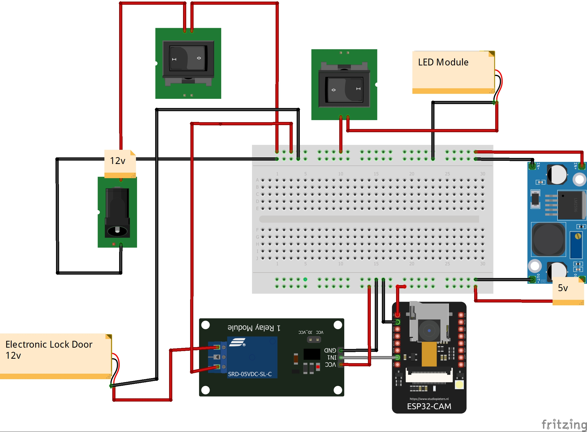

# Face Recognition Door Lock

Welcome to our innovative project that combines ESP32-CAM face recognition technology with an automatic door opening function. This project provides a safe and effective access control solution for homes, offices, and other environments where access should be restricted to authorized personnel only. With the ESP32-CAM module, the project can recognize authorized persons and automatically open the door for them using advanced machine learning algorithms.

## Table of Contents

- [Installation](#installation)
- [Usage](#usage)
- [Features](#features)
- [Configuration](#configuration)
- [Acknowledgments](#acknowledgments)
- [Contributing](#contributing)
- [License](#license)
- [Contact](#contact)

## Installation

1. Clone or Download the repository to your local machine using the following command:
```
git clone https://github.com/kershrita/Face-Recognition-Door-Lock.git
```
2. Assemble according to this circuit diagram:


3. Components:
	- 1 * ESP32-CAM Development Board
	- 1 * USB to TTL Converter - FT232RL FTDI Serial Module
	- 1 * Cabinet Door Lock Electric
	- 1 * LM2596S DC-DC Converter
	- 1 * Relay Module 5V
	- 2 * LED Module
	- 2 * Switch
	- 1 * Power Jack

4. Make sure that you have installed ESP32 boards and necessary libraries in your IDE.
5. Step by step guidence with images you will find it **[here](Getting%20Started.pdf)**.

## Usage

1. Make sure there is a Wi-Fi network with the name "T" and the password "12345678". Connect the USB to the laptop and open the Serial Monitor in the Arduino IDE to display the IP address for camera control, face registration, face deletion, and settings.
2. Disconnect the USB and connect the power adapter.
3. Enter the IP address in a browser to access the camera interface.
4. To add a face, enter the name of the person, stand in front of the camera, and press "ADD USER". Wait for the face to be stored and appear below.
5. To activate the normal camera shooting mode, select "STREAM CAMERA".
6. To activate the face detection mode, choose "DETECT FACES". This mode recognizes whether there is a face in the image.
7. To activate the mode for opening and closing the door for registered persons, choose "ACCESS CONTROL".

## Features

- Facial recognition technology to identify authorized individuals.
- Automatic door opening for recognized faces.
- Enhanced security and access control.
- Easy hands-free operation.
- Easy setup and configuration.

## Configuration

The biometric attendance system offers several uses and applications across various domains:

- **Residential Security**: Improve home security by allowing access only to authorized individuals, replacing traditional locks with a face recognition system.
- **Office and Workplace**: Control access to offices, sensitive areas, or restricted zones, ensuring that only authorized personnel can enter.
- **Institutions and Government Organizations**: Enhance security in educational institutions, research facilities, and government organizations by controlling access to restricted areas and data centers.
- **Smart Homes Integration**: Integrate the project with a smart home system to remotely monitor and control access to the property, providing convenience and peace of mind.

## Acknowledgments

We would like to acknowledge the following resources and libraries that have been instrumental in developing Kids Learning Program:

- **[Arduino IDE](https://www.arduino.cc/en/software)**:  An open-source integrated development environment (IDE) used for programming Arduino boards.
- **ESP32-CAM**: A versatile development board that combines the ESP32 microcontroller with a camera module, allowing you to capture and process images or stream video in your projects. It provides a compact and cost-effective solution for building projects involving visual data.

## Contribution
Contributions are welcome to face recognition door lock and can help improve the project in various ways.

## License

Face Recognition Door Lock is released under the [MIT License](LICENSE).

## Contact

- Mail: ashrafabdulkhaliq80@gmail.com
- LinkedIn: https://www.linkedin.com/in/ashraf-abdulkhaliq
- GitHub: https://github.com/kershrita