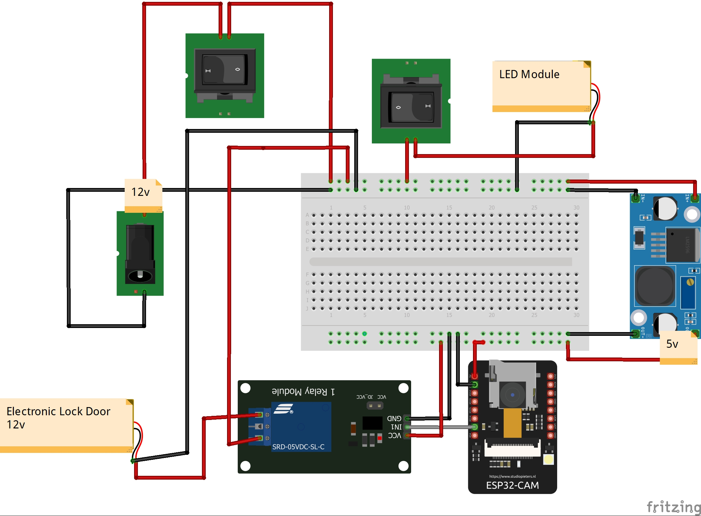

# Face Recognition Door Lock (ESP32-CAM)

Edge AI access control system that performs on-device face recognition and actuates a physical door lock in real time.

## Overview

This project is an embedded AI/ML system for secure physical access control using ESP32-CAM.
It is engineered as an end-to-end product pipeline, not only a face model demo.

It focuses on:
- On-device inference for privacy-preserving identity verification
- Real-time control flow from camera stream to relay actuation
- Persistent identity enrollment and management in flash memory

Primary use cases:
- Smart home and apartment entrance control
- Small office or lab room access management
- Low-cost edge access nodes where cloud inference is not acceptable

## Architecture

The system is organized around an ESP32-CAM edge node, with a browser client as the operator interface.

Runtime architecture flow:
- Browser Client <-> ESP32-CAM Node: sends commands and receives status/events over WebSocket
- Camera Capture -> Face Detection -> Face Recognition: real-time on-device vision pipeline
- Face Recognition <-> Flash Identity Store: enrolled identities are read/written in persistent flash
- Decision Logic -> Door Lock Actuator: recognition outcomes are translated into access decisions
- Door Lock Actuator -> Relay -> Unlock Timer + Auto-Lock Behavior: physical unlock is time-bounded and reset automatically

Design intent:
- Keep biometric processing and access decisions on-device for low latency and privacy
- Separate identity persistence from decision execution for predictable state recovery after reboot
- Isolate actuation timing logic to reduce lock-state errors in real deployments

## Architecture Diagram


This diagram is placed directly under the architecture section so reviewers can understand system boundaries before implementation details.

Diagram description:
- Top-right block: Browser Client controls the system and receives runtime feedback.
- Center block: ESP32-CAM Node orchestrates all edge processing and control.
- Mid-layer blocks: Camera Capture, Face Detection, Face Recognition, Flash Identity Store, and Decision Logic represent the core runtime modules.
- Control branch: Decision Logic drives Door Lock Actuator for authorize/deny outcomes.
- Device branch: Door Lock Actuator fans out to Relay control and WebSocket event signaling.
- Safety branch: Relay state transitions are constrained by Unlock Timer and Auto-Lock Behavior.

## Features

- On-device face recognition with no cloud dependency
- Multi-mode operation: camera stream, face detect, user enroll, and access control
- Enrollment workflow with repeated confirmation samples for stability
- Persistent face database in flash (supports identity delete and full reset)
- Real-time browser feedback for detection and recognition states
- Relay-based door unlock with automatic timeout re-lock

## Technical Highlights

- Edge-first design: inference and access decisions execute directly on ESP32-CAM to reduce latency and protect biometric data
- Deterministic control logic: explicit finite-state transitions for reliable mode changes
- Resource-aware camera configuration: adapts frame settings when PSRAM is available
- Durable identity lifecycle: enrollment, lookup, single-delete, and delete-all operations integrated with flash persistence
- Safety-oriented door control: relay is auto-reset after a fixed unlock interval (`5000 ms`)
- Practical enrollment constraints: configurable identity capacity and confirmation count (`FACE_ID_SAVE_NUMBER`, `ENROLL_CONFIRM_TIMES`)

## Tech Stack

| Layer | Technologies |
| --- | --- |
| Device Firmware | Arduino (C/C++) on ESP32-CAM |
| Vision/ML | ESP face detection and recognition modules (`fd_forward`, `fr_forward`, `fr_flash`) |
| Communication | HTTP server + WebSocket server |
| Frontend | Embedded HTML/CSS/JavaScript web interface |
| Hardware | ESP32-CAM (AI Thinker), OV2640 camera, relay module, electric door lock |
| Persistence | ESP32 flash storage for face identity records |

## Getting Started

### Hardware

- ESP32-CAM development board (AI Thinker)
- USB-to-TTL adapter (for flashing)
- Relay module (5V) and electric door lock
- Power supply and supporting components as defined in `Circuit.fzz`

Reference assets:
- Circuit image: [assets/Circuit.jpg](assets/Circuit.jpg)
- Wiring source file: [assets/Circuit.fzz](assets/Circuit.fzz)
- Setup walkthrough: [assets/Getting Started.pdf](assets/Getting%20Started.pdf)



### Software Prerequisites

- Arduino IDE
- ESP32 board package installed in Arduino IDE
- Required libraries used by the sketch (WebSocket and ESP32 camera/face stack)

### Build and Flash

```bash
git clone https://github.com/kershrita/Face-Recognition-Door-Lock.git
cd Face-Recognition-Door-Lock
```

1. Open `FaceDoorEntryESP32Cam/FaceDoorEntryESP32Cam.ino` in Arduino IDE.
2. Update Wi-Fi credentials in the sketch (`ssid`, `password`) for your network.
3. Select ESP32-CAM board profile and correct upload port.
4. Flash firmware and open Serial Monitor at `115200` baud.
5. Copy the printed device IP and open it in a browser.

### Runtime Workflow

1. Start camera stream from the UI.
2. Enroll authorized users with `ADD USER`.
3. Switch to `ACCESS CONTROL` mode.
4. Present a registered face to trigger unlock.

## Results

Current implementation delivers system-level outcomes:

- End-to-end on-device recognition and access decision pipeline
- Identity enrollment requiring multiple confirmation captures (`ENROLL_CONFIRM_TIMES = 5`)
- Configured identity capacity per device (`FACE_ID_SAVE_NUMBER = 7`)
- Automatic door re-lock after configured unlock window (`interval = 5000 ms`)
- Face identities remain available after reboot via flash persistence

Benchmark note:
- This repository currently demonstrates operational performance and deployment behavior.
- Standardized dataset metrics (accuracy, FAR/FRR, latency distributions) are not yet packaged in this repo.

## License

Released under the [MIT License](LICENSE).